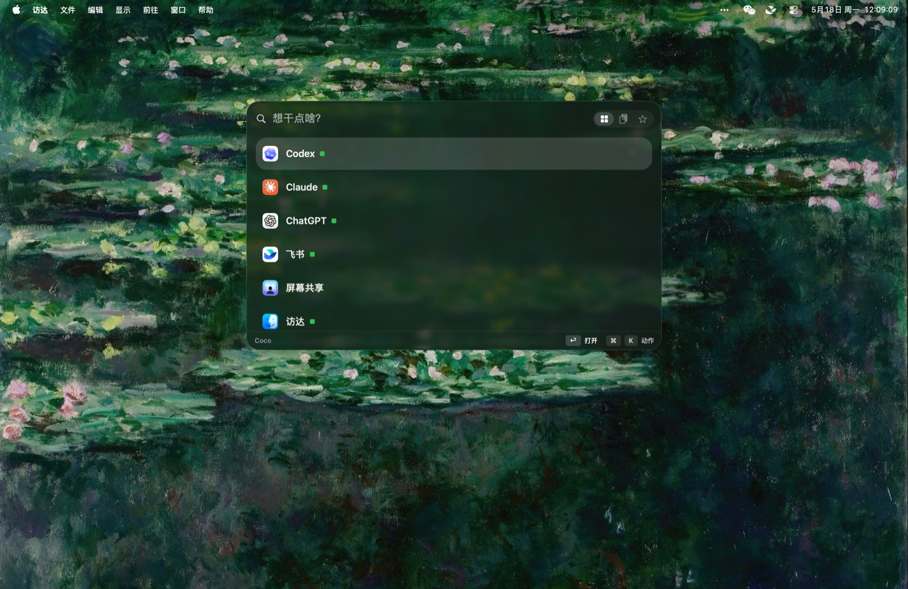
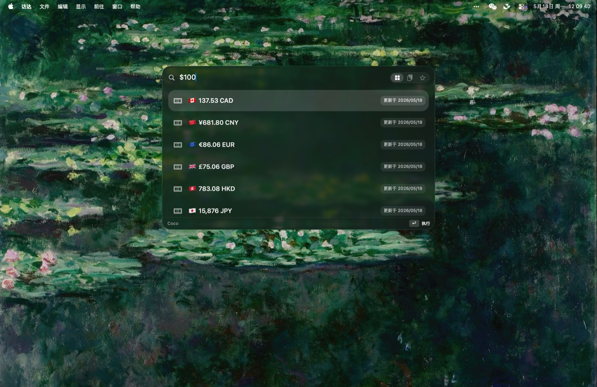

  

<h1 align="center">Coco</h1>

A fast, native macOS launcher. One hotkey for apps, clipboard, math, and more.

  
  
  

  <a href="https://butterflydream-ai.github.io/coco-app/Coco-macos.dmg"><b>⬇&nbsp; Download for macOS</b></a>
  &nbsp;·&nbsp; <a href="#install">Install</a>
  &nbsp;·&nbsp; <a href="#中文">中文</a>

---

  

Coco lives in your menu bar and stays out of the way until you press **⌥Space**. Then it's right there: launch an app, paste from clipboard history, do quick math, convert units or currency, drop an emoji, run a saved command.

Written in Swift + AppKit. Around 2&nbsp;MB, instant to summon, no Electron.

## Features

- **App launcher** — fuzzy search with pinyin / romaji / Hangul-initial matching, plus per-app actions.
- **Clipboard history & favorites** — searchable, Space to preview, paste straight back into the app you came from.
- **Calculator & conversion** — arithmetic, units, live currency rates.
- **Emoji & web search** — grab an emoji, or send a query to your search engine.
- **Shell command aliases** — bind your own commands and fire them from the bar.
- **Plugins & Coco Store** — browse and install JS plugins in-app.
- **Four languages** — English, 简体中文, 日本語, 한국어, following your system.
- **Silent auto-update** — new versions download and install themselves.

## In action

  
  &nbsp;
  

Type an amount for live currency rates, or any expression for a quick answer.

## Install

1. [Download the DMG](https://butterflydream-ai.github.io/coco-app/Coco-macos.dmg) (or the [zip](https://butterflydream-ai.github.io/coco-app/Coco-macos.zip)).
2. Drag **Coco** into **Applications**.
3. First launch: right-click Coco → **Open**. The build is ad-hoc signed, so Gatekeeper asks once.
4. Press **⌥Space**. The first run walks you through the couple of permissions it needs.

**Requirements:** macOS 14+ on Apple Silicon.

After that Coco keeps itself current — no need to come back here.

## Shortcuts

| Action | Default |
| --- | --- |
| Launcher | ⌥Space |
| Clipboard history | ⇧⌘V |
| Preview item | Space |
| Open / run / paste | ↩ |

All rebindable in Settings.

## 中文

Coco 是一个原生 macOS 启动器，常驻菜单栏，按 **⌥Space** 唤出：搜应用、翻剪贴板历史、算个数、换算单位汇率、找 emoji、跑自定义命令。Swift + AppKit 写的，约 2&nbsp;MB，不吃内存。

- 应用搜索支持拼音 / 罗马音 / 韩文初声，含逐应用动作
- 剪贴板历史 + 收藏，空格预览，一键粘回原应用
- 计算器、单位换算、实时汇率、Emoji、网页搜索、Shell 命令别名
- JS 插件 + 内置 Coco Store
- 中 / 英 / 日 / 韩四语，跟随系统
- 静默自动更新

[下载 DMG](https://butterflydream-ai.github.io/coco-app/Coco-macos.dmg) → 拖进「应用程序」→ 首次右键「打开」→ 按 ⌥Space。需 macOS 14+ Apple Silicon。

## Author

Built by **YAN** · [@yan_ai_labs](https://x.com/yan_ai_labs)
